<html lang="id">
<head>
  <meta charset="UTF-8" />
  <meta name="viewport" content="width=device-width, initial-scale=1.0" />
  <title>Ghaisan Utama Indomedia</title>
  <link rel="stylesheet" href="styles.css" />
  <!-- Google Fonts -->
  <link rel="preconnect" href="https://fonts.googleapis.com" />
  <link
    href="https://fonts.googleapis.com/css2?family=Poppins:wght@300;400;600&display=swap"
    rel="stylesheet"
  />
  
</head>
<body>
  <!-- Header -->
  <header>
    

      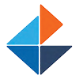
      

        <h1></h1>
      

      <nav style="margin-left: auto;">
        <ul>
          <li><a href="#home">Beranda</a></li>
          <li><a href="#about">Tentang Kami</a></li>
          <li><a href="#services">Layanan</a></li>
          <li><a href="#portfolio">Portofolio</a></li>
          <li><a href="#contact">Kontak</a></li>
        </ul>
      </nav>
    

  </header>

  <!-- Hero Section -->
  <section id="home" class="hero" style="background: url('foto1.jpg') no-repeat center center/cover;">
    

        <h1> </h1>
        

        

        <a href="#contact" class="btn">Hubungi Kami</a>
    

</section>
  
  <!-- About Section -->
  <section id="about" class="about">
    

      <h2>Tentang Kami</h2>
      

        Kami adalah perusahaan yang berkomitmen untuk memberikan layanan
        terbaik dan solusi inovatif untuk kebutuhan bisnis Anda. Tim kami
        terdiri dari para ahli di berbagai bidang yang siap membantu Anda.
      

    

  </section>

  <!-- Services Section -->
  <section id="services" class="services">
    

      <h2>Services</h2>
      

        

          
          <h3>Event Organizer Services</h3>
          

            DIdirikan tahun 2009, dan sampai sekarang telah menjadi partner terpercaya oleh banyak perusahaan dan pribadi, untuk keperluan event organizing. Mulai dari acara formal ataupun non-formal yang selalu berhasil meninggalkan kesan tersendiri bagi client
          

        

        

          
          <h3>Construction Serice</h3>
          

            Didirikan ditahun 2012 sampai sekarang, didukung tim teknis dan arsitek berpengalaman, menjadi Konsultan Perencanaan serta Pelaksanaan Konstruksi Perumahaan, Pengelolaan Real Estate, Renovasi Rumah dan Kantor Eksterior/Interior
          

        

        

          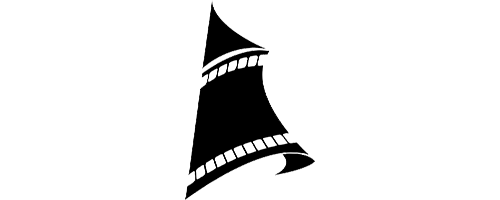
          <h3>Cinematography Service</h3>
          

            Didirikan ditahun 2015, dan sampai sekarang telah membuat beberapa film layar lebar dengan jumlah penoton yang lebih dari lima ratus ribu orang. Disamping itu Finisia, juga telah memproduksi beberapa video, berupa compay profile, comercial dan lain-lain.
          

        

      

    

  </section>

  <!-- Portfolio Section -->
  <section id="portfolio" class="portfolio">
    

      <h2>Portofolio Kami</h2>
      

        

          
        

        

          
        

        

          
        

      

    

  </section>

  <!-- Modal for Portfolio 1 -->
  

    

      &times;
      <button class="modal-prev" onclick="prevImage('portfolio1')">&#10094;</button>
      <button class="modal-next" onclick="nextImage('portfolio1')">&#10095;</button>
      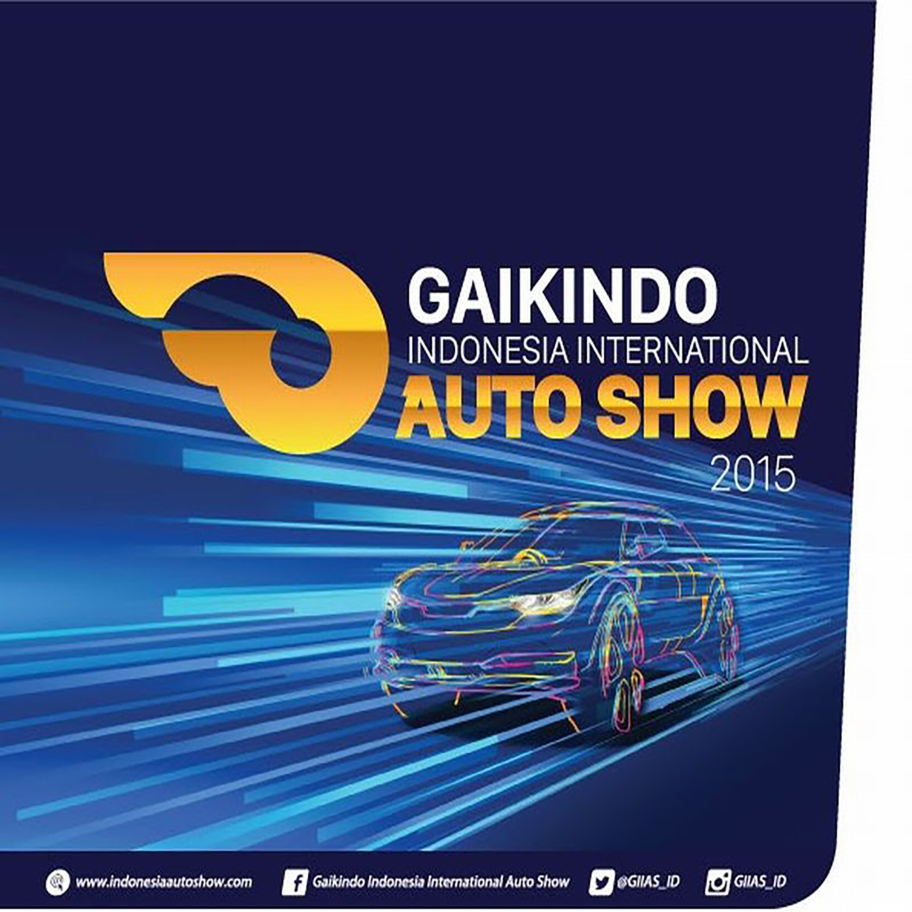
      
      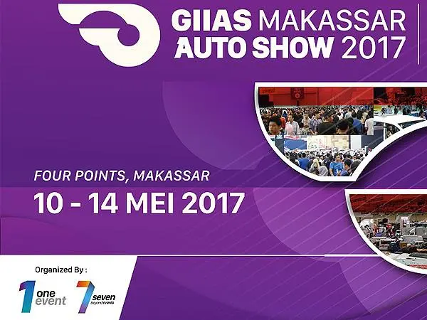
      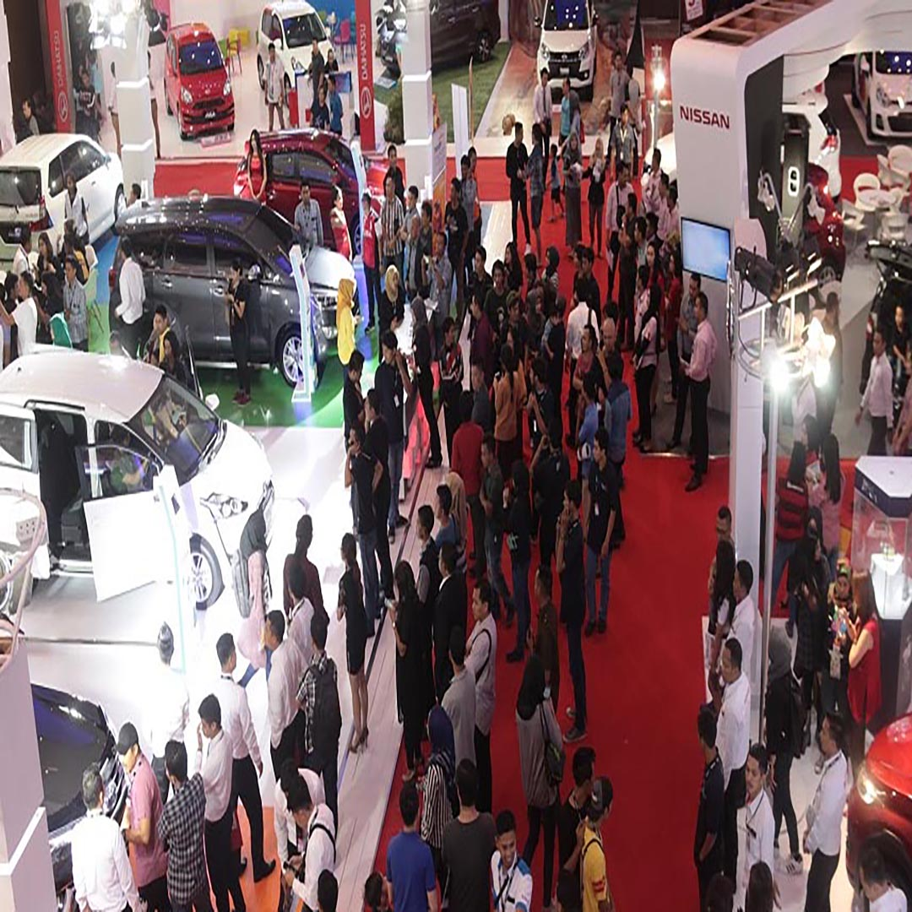
      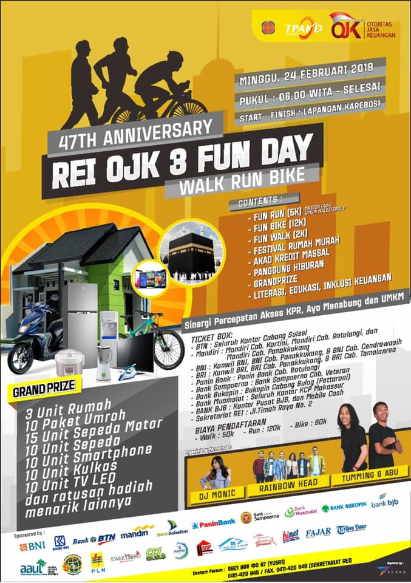
      
      
    

  

  <!-- Modal for Portfolio 2 -->
  

    

      &times;
      <button class="modal-prev" onclick="prevImage('portfolio2')">&#10094;</button>
      <button class="modal-next" onclick="nextImage('portfolio2')">&#10095;</button>
      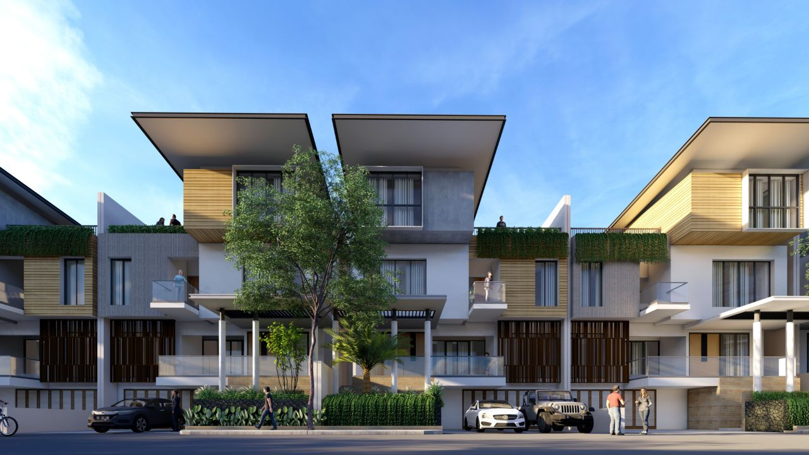
      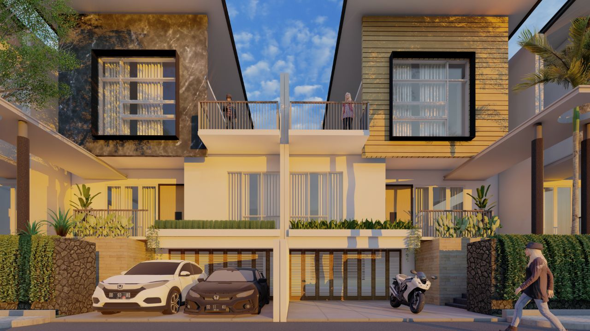
      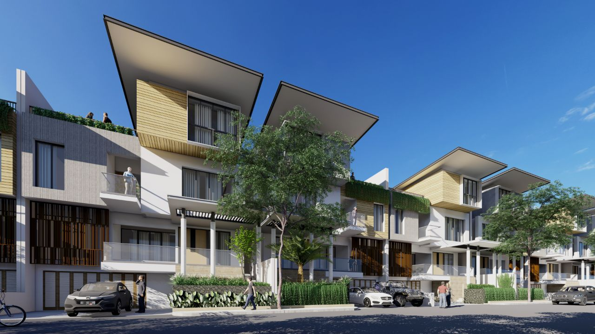
      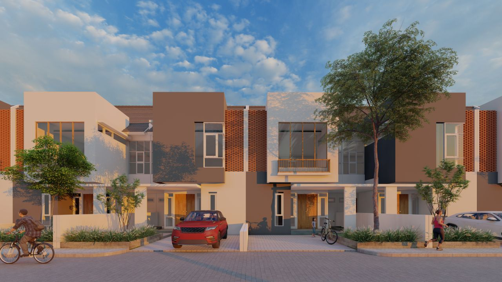
      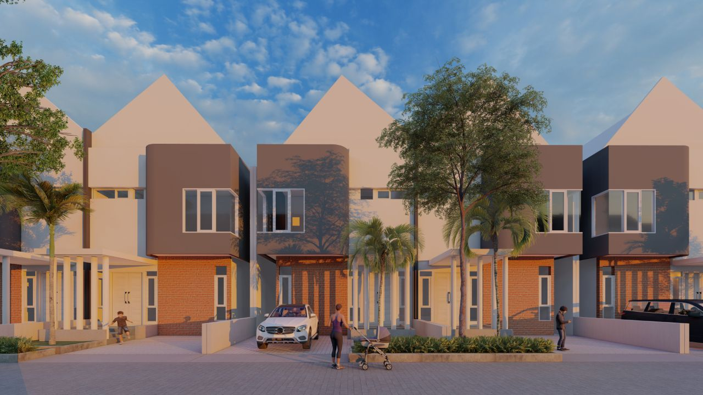
      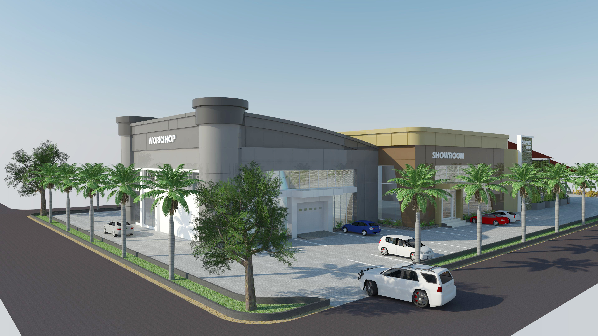
    

  

  <!-- Modal for Portfolio 3 -->
  

    

      &times;
      <button class="modal-prev" onclick="prevImage('portfolio3')">&#10094;</button>
      <button class="modal-next" onclick="nextImage('portfolio3')">&#10095;</button>
      
      
      
      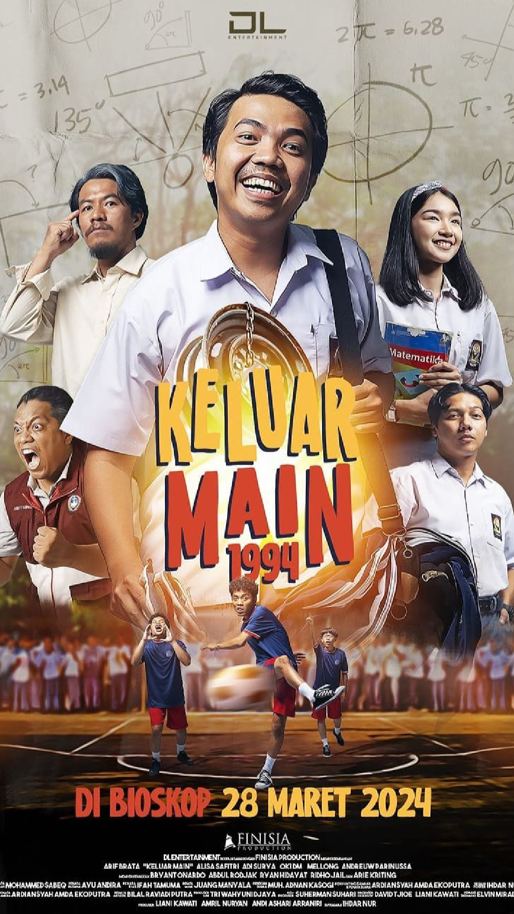
      
    

  

  <!-- Contact Section -->
  <section id="contact">
    

      <h2>Kontak Kami</h2>
      

        Hubungi kami untuk informasi lebih lanjut atau jika Anda memiliki
        pertanyaan tentang layanan kami.
      

      <!-- Form Kontak atau informasi kontak -->
    

  </section>

  <!-- JavaScript -->
  
</body>
</html>
