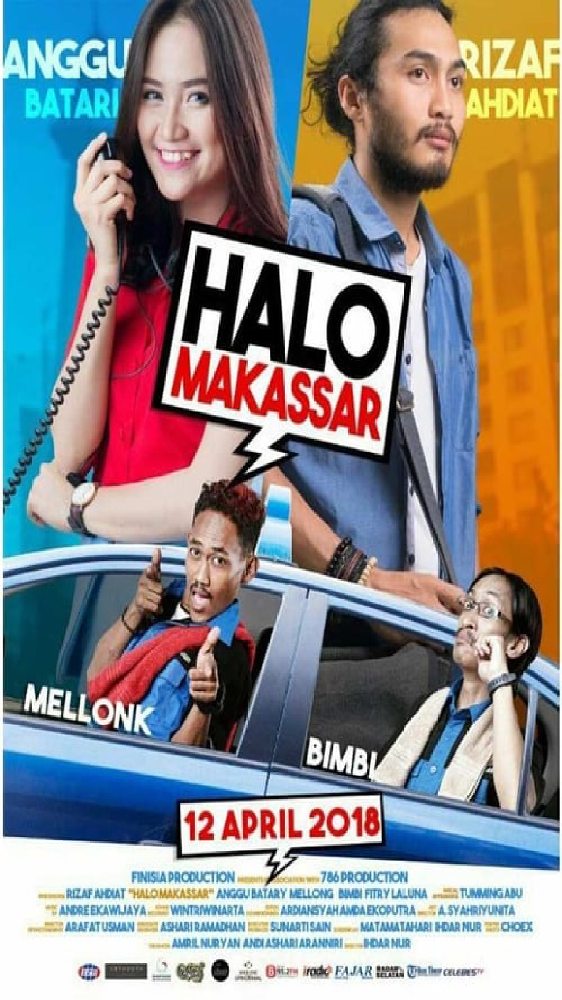

<!DOCTYPE html>
<html lang="en">
<head>
    <meta charset="UTF-8">
    <meta name="viewport" content="width=device-width, initial-scale=1.0">
    <meta name="description" content="Contoh website responsif dan kreatif">
    <title>Website Kreatif dan Responsif</title>
    

</head>
<body>
    <header>
        

            <h1>Logo</h1>
        

        <nav class="navbar">
            <ul>
                <li><a href="#home">Home</a></li>
                <li><a href="#about">About</a></li>
                <li><a href="#services">Services</a></li>
                <li><a href="#portfolio">Portfolio</a></li>
                <li><a href="#contact">Contact</a></li>
            </ul>
            

                
                
                
            

        </nav>
    </header>

    <section id="home">
        

            <h2>Welcome to Our Creative Website</h2>
            
We design with passion and create with love.

            <a href="#about" class="cta-button">Learn More</a>
        

    </section>

    <section id="about" class="section about">
        

            <h2>About Us</h2>
            

                

                    <h3>2009</h3>
                    
Pada tahun 2009, bendera ALPRODUCTION beralih menjadi perusahaan perseorangan. Berfokus pada bidang Event Organizer dan Profesional Exhibition Organizer, kami memulai perjalanan ini dengan pengalaman, kemampuan, dan keterampilan sumber daya manusia yang terlibat sejak awal, sehingga dapat bekerja dengan baik.

                

                

                    <h3>2011</h3>
                    
Bisnis berkembang ke berbagai bidang. Pada tahun 2011, terbentuk Media Majalah, Eventku Magazine.

                

                

                    <h3>2012</h3>
                    
Terbentuk designeRoom, Konsultan Perencana & Konstruksi, Konsultan Pengawasan, Pelaksana Konstruksi, Pengelolaan Real Estate, Pekerjaan Interior/Eksterior.

                

                

                    <h3>2013</h3>
                    
Terbentuk CV. Ghaisan Utama Indomedia yang menaungi berbagai jenis usaha di bidang entertaind dan konstruksi.

                

                

                    <h3>2014</h3>
                    
Terbentuk jasa Multimedia (Photo, Video & Design Grafis).

                

                

                    <h3>2015</h3>
                    
Terbentuk Finisia Production, Production House yang memproduksi Film Layar lebar, Series & Iklan Cinematography.

                

                

                    <h3>2018</h3>
                    
Terbentuk Kopi Batas (KOBA), PT. Ghaisan Maharga Perkasa & PT. Ghaisan Utama Indoprima.

                

                

                    <h3>2020</h3>
                    
Terbentuk Yayasan Insan Sahasra Zawawi, dengan brand Gerakan 1.000 Kebaikan. Kami berkomitmen memberikan pelayanan produk dan jasa yang berkualitas, konsisten, dan memiliki nilai tambah demi tercapainya tujuan bersama. Dengan dukungan sumber daya manusia yang berkemampuan tinggi dan berpengalaman di bidang masing-masing, Ghaisan Utama Indomedia mampu menyediakan berbagai jasa di bidang Konstruksi, Multimedia, & Event Organizer dengan prinsip kemitraan yang selalu mengedepankan kualitas dan kepuasan (Value of Money).

                

            

        

    </section>
    <!-- Layanan Kami Section -->
    <section id="services" class="section services">
        

            <h2>VISI, MISI & SERVICES</h2>
            

                

                    <h3>VISI</h3>
                    
Menjadi Pemimpin Industri Kreatif di Indonesia Timur

                

                

                    <h3>MISI</h3>
                    
Menjadi parner bisnis yang Realible dengan menanamkan nilai Profesionalisme dalam menciptakan karya yang mengesankan

                

                

                    
                    <h3>Event Organizer Services</h3>
                    
DIdirikan tahun 2009, dan sampai sekarang telah menjadi partner terpercaya oleh banyak perusahaan dan pribadi, untuk keperluan event organizing. Mulai dari acara formal ataupun non-formal yang selalu berhasil meninggalkan kesan tersendiri bagi client

                

                

                    
                    <h3>Contruction Services</h3>
                    
Didirikan ditahun 2012 sampai sekarang, didukung tim teknis dan arsitek berpengalaman, menjadi Konsultan Perencanaan serta Pelaksanaan Konstruksi Perumahaan, Pengelolaan Real Estate, Renovasi Rumah dan Kantor Eksterior/Interior

                

                

                    
                    <h3>Cinematography Services</h3>
                    
Didirikan ditahun 2015, dan sampai sekarang telah membuat beberapa film layar lebar dengan jumlah penoton yang lebih dari lima ratus ribu orang. Disamping itu Finisia, juga telah memproduksi beberapa video, berupa compay profile, comercial dan lain-lain.

                

            

        

    </section>

    < <!-- Portfolio Section -->
    <section id="portfolio" class="section portfolio">
        

            <h2>Portofolio</h2>
            

                <!-- Project 1 -->
                

                    
                

                <!-- Project 2 -->
                

                    
                

                <!-- Project 3 -->
                

                    
                

            

        

    </section>

    <footer>
        
&copy; 2024 Website Kreatif. All rights reserved.

    </footer>

      <!-- Modal for Gallery 1 -->
      

        &times;
        

            
            
            
            
            
        

    

    <!-- Modal for Gallery 2 -->
    

        &times;
        

            
            
            
            
            
            
            
            
        

    

    <!-- Modal for Gallery 3 -->
    

        &times;
        

            
            
            
            
            
            
        

    

    
</body>

</html>

</body>
</html>
